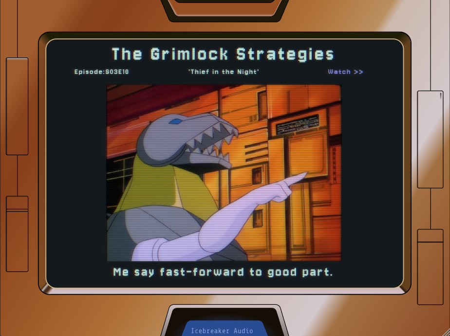

# The Grimlock Strategies
Words of inspiration from everybody's favourite [Dinobot leader](https://tfwiki.net/wiki/Grimlock_(G1)).

## Overview
Inspired by [The Oblique Strategies](https://en.wikipedia.org/wiki/Oblique_Strategies) and a certain 1980s [cartoon](https://tfwiki.net/wiki/The_Transformers_(cartoon)) for children, **The Grimlock Strategies** is designed to help break creative block by offering words of encouragement or advice from a giant robot dinosaur.
>### [Robot Dinosaurs might be useful.](https://youtu.be/5xOg3uBAL6s?si=0jjhkLUm6bfsOFsM&t=201)
>Optimus Prime

## The Plugin
When loaded, the plugin will randomly select from the 114 included quotes that were hand selected from 18 episodes and one feature film.  
The quote is displayed along with a screenshot, episode information, and a link to the YouTube video of the episode, all rendered in a format that should be [familiar](https://tfwiki.net/wiki/Teletraan_I) to adults of a certain age.

*Inspiring words from an inspiring leader.*

The selected quote is saved with the plugin instance and is saved with the host project. This lets you do things like put an instance on each track of a project and use those to guide your session.  
The UI can also be freely resized.

The plugin itself is an effect that simply passes the audio through unchanged.

## Dependancies
The effect was built using the [JUCE Framework](https://github.com/juce-framework/JUCE), which has been added to the git project as a submodule. Likewise the CLAP format support is added using the [clap juce extensions](https://github.com/free-audio/clap-juce-extensions) library (also added as a submodule). When JUCE officially support CLAP, I'll update that part of the codebase.

The UI uses the **Jersey10** font which has an OLF license.

## A Note on the use of Claude AI
I have included a `CLAUDE.md` file in this repository. While the majority of the project was written by a human (me), Claude was used towards the end for assistance in refactorings, optimizations and bug fixes.

In my experience, tools like Claude are best viewed as advanced auto-complete. I find them to be unreliable with large or complex tasks, especially for audio projects with concurrency and realtime processing concerns. However they do save time when writing code that requires a lot of typing, but not a lot of thinking.

I am including this note in the interest of openess, but to also let it be known that I hand-selected all the included quotes while watching every episode of the original Transformers cartoon that includes Grimlock.

## Build
**The Grimlock Strategies** can be built using CMake. The CMake files were based off the [pamplejuce](https://github.com/sudara/pamplejuce) template, but simplified.

Personally I use [Visual Studio Code](https://code.visualstudio.com/) for working on and building the project, but you can also build from the terminal if you have CMake installed and set up for that.

## Install
Pre-built binaries are available [here](https://github.com/IcebreakerAudio/The-Grimlock-Strategies/releases/tag/v0.9.0). You just need to place them in the correct directory (info is available on the release page).

Note that Apple have a very heavy-handed security system that will probably block the plugins from being used. You will need to update the MacOS security features to either allow unsigned files, or to exclude the plugin files (the method for how to do this changes now and again, so Google for the latest technique).

If you build the plugins yourself then you won't need to deal with the security stuff since you create the plugin binaries.

## Fun Fact
Did you know Grimlock isn't from Cybertron, but is actually native to Earth since he was built there by Wheeljack and Ratchet.